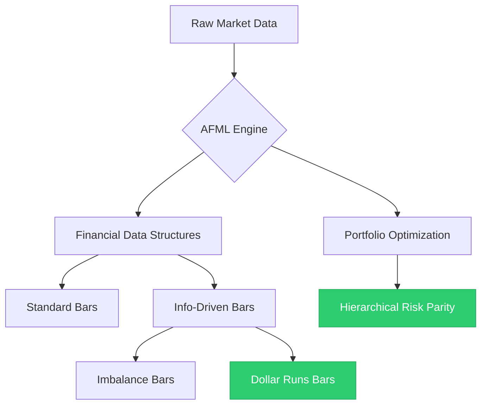

# Advances in Financial Machine Learning (AFML)

Implementation of advanced financial machine learning techniques based on Marcos López de Prado's "Advances in Financial Machine Learning".

## Project goal
The primary goal of this project is to implement and master the complete theoretical framework presented in the book **"Advances in Financial Machine Learning"** by Marcos López de Prado. 

This repository serves as a practical codebase for transforming mathematical theories into production-ready financial engineering tools, with a focus on high-performance computing (Numba-accelerated) and modern software architecture.



---

## Project Structure

```text
src/
├── models/
│   ├── opti/                   # Optimization & Portfolio Construction
│   │   └── HRP.py              # Hierarchical Risk Parity implementation
│   └── preprocess/             # Financial Data Structures
│       ├── info_driven.py      # Imbalance & Runs Bars engines (Tick-by-tick)
│       └── test_data_driven.ipynb
├── services/
│   ├── crawlers/               # Data Ingestion
│   │   ├── get_gold_data.py    # Gold price crawer
│   │   └── stocks_data.py      # Stock data collection & merging
│   └── data_loader.py          # Centralized data processing pipeline
└── utils/
    ├── config.py               # Global configurations
    └── math_engines.py         # Numba-accelerated math kernels
```

---

## Implementation Progress

Overall Theory Completion: `15%`

### Part 1: Data Analysis
*   **Chapter 2: Financial Data Structures**
    *   [x] Standard Bars (Time, Volume, Dollar)
    *   [x] Information-Driven Bars
        *   [x] Imbalance Bars (Tick/Dollar)
        *   [x] **Dollar Runs Bars** — *Recently Completed*
*   **Chapter 3: Labeling** (Planned)
*   **Chapter 4: Sample Weights** (Planned)
*   **Chapter 5: Fractional Differentiation** (Planned)

### Part 2: Modeling
*   **Chapter 16: Machine Learning Asset Allocation**
    *   [x] Hierarchical Risk Parity (HRP) 
    *   [ ] Nested Clustered Optimization (NCO)

### Part 3: Backtesting
*   [ ] Chapter 6: Ensemble Methods
*   [ ] Chapter 7: Cross-Validation
*   [ ] Chapter 8: Feature Importance
*   [ ] Chapter 10: Bet Sizing

---

## Technologies
- **Languages:** Python 3.x
- **Core Libraries:** `Pandas`, `NumPy`, `SciPy`
- **Performance:** `Numba` (JIT Acceleration for streaming calculations)
- **Data Source:** Custom crawlers for Financial Markets